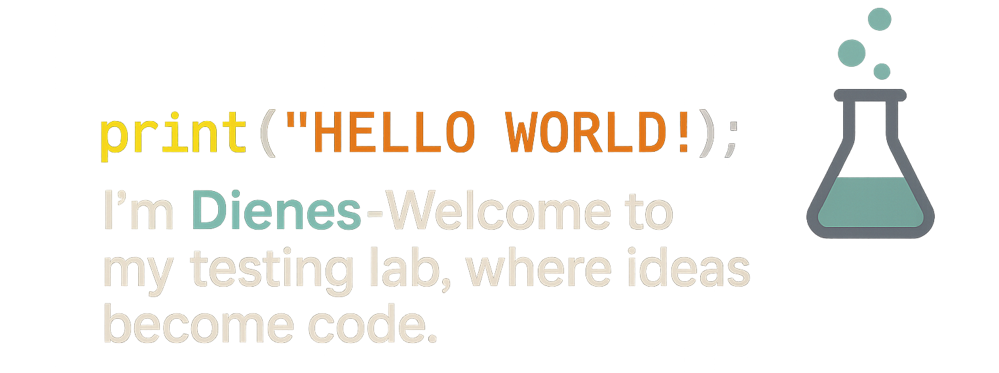

 

### 🚀 Hey, I'm Dienes Stein

QA Automation Engineer passionate about **software quality**, **test frameworks**, and **continuous improvement**.  
I enjoy transforming complex testing processes into clean, reliable, and maintainable automation.

💼 I work with:
**Cypress**, **Robot Framework**, **Postman**, **Cucumber**, and **Node.js**

🧩 I love:
Automating repetitive tasks, improving CI/CD pipelines, and designing smarter tests.

💬 Open for ideas and collaborations → [share your thoughts](https://github.com/dieneslab/dieneslab/issues)

---

### 🧠 Tech Stack

  
  
  
  
  
  
  
  
  
  

 

  
  

 

---

### ✨ My Favorite VS Code Extensions

To make development and test automation even smoother, here are my favorite Visual Studio Code extensions that I personally use in this project:

| Extension | Description | Publisher |
|------------|--------------|------------|
| **Cucumber (Gherkin) Full Support** | Full language support, formatting, and autocomplete for Cucumber (Gherkin) syntax | Alexander Krechik |
| **Dracula Theme Official** | Beautiful dark theme for VS Code and other editors | Dracula Theme |
| **GitHub Actions** | Manage and run GitHub Actions workflows directly from VS Code | GitHub |
| **GitHub Copilot** | Your AI pair programmer | GitHub |
| **GitHub Copilot Chat** | Interactive AI chat assistant powered by GitHub Copilot | GitHub |
| **JavaScript and TypeScript Nightly** | Enables TypeScript@next to power VS Code's built-in JavaScript and TypeScript support | Microsoft |
| **Material Icon Theme** | Material Design icons for Visual Studio Code | Philipp Kief |
| **One Dark Pro** | Atom's iconic dark theme for Visual Studio Code | binaryify |
| **Playwright Test for VSCode** | Integrated Playwright test runner and debugging support | Microsoft |
| **Prettier – Code Formatter** | Opinionated code formatter for clean and consistent style | Prettier |
| **Rainbow CSV** | Syntax highlighting and SQL-like queries for CSV and TSV files | mechatroner |
| **Robot Framework Language Server** | Full language support for Robot Framework | Robocorp |

 

---

### 🌐 Let's Connect

  

This repository is licensed under the MIT License. See the [LICENSE](./LICENSE) file for details.
